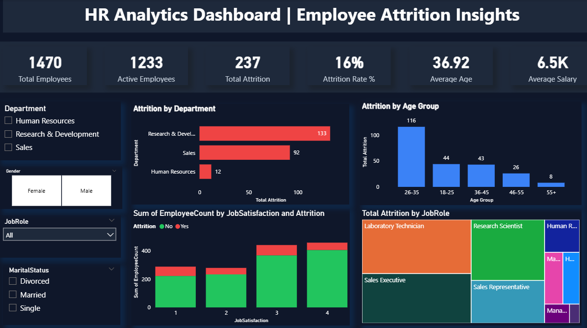

# 📊 HR Analytics Dashboard | Employee Attrition Insights

An interactive HR Analytics Dashboard built using **Power BI** to analyze employee attrition patterns and workforce insights using the IBM HR Employee Attrition dataset.

---

## 🖼️ Dashboard Preview

---

## 📌 Project Overview

This dashboard provides data-driven insights into employee attrition by analyzing key workforce metrics and patterns.  

The objective of this project is to help HR teams understand the major factors influencing employee turnover and support data-driven retention strategies.

---

## 🎯 Key KPIs

- 👥 Total Employees  
- 🟢 Active Employees  
- ❌ Total Attrition  
- 📉 Attrition Rate (%)  
- 🎂 Average Age  
- 💰 Average Salary  

---

## 📊 Dashboard Insights

### 🔹 Attrition by Department  
Identifies departments with the highest employee turnover.

### 🔹 Attrition by Age Group  
Analyzes which age groups are more likely to leave the organization.

### 🔹 Job Satisfaction vs Attrition  
Shows the relationship between employee satisfaction levels and attrition trends.

### 🔹 Attrition by Job Role  
Highlights roles experiencing higher attrition rates.

---

## 🎛️ Interactive Features

The dashboard includes dynamic filters for:

- Department  
- Job Role  
- Gender  
- Marital Status   

All visuals update automatically based on selected filters.

---

## 🛠️ Tools & Technologies Used

- Microsoft Power BI  
- DAX (Data Analysis Expressions)  
- Data Modeling  
- Data Visualization Techniques  

---

## 📂 Dataset

- IBM HR Employee Attrition Dataset  
- Public HR analytics dataset (commonly available on Kaggle)

---

## 🚀 Project Files

- `HR_Analytics_Dashboard.pbix` – Power BI dashboard file  
- `HR_Dashboard.png` – Dashboard preview image  
- `IBM HR Employee Attrition Data.csv` – Dataset  

---

## 📈 Business Value

This dashboard helps:

- Identify high-risk attrition areas  
- Understand workforce demographics  
- Analyze satisfaction-driven turnover  
- Support HR decision-making  

---

## 👩‍💻 Author

**Arati Biradar**  
Aspiring Data Analyst | Power BI Enthusiast  

---

⭐ If you found this project useful, feel free to star the repository!
